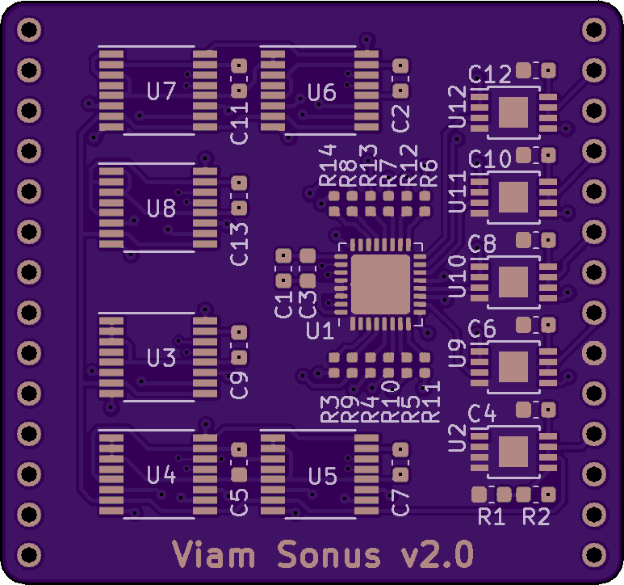
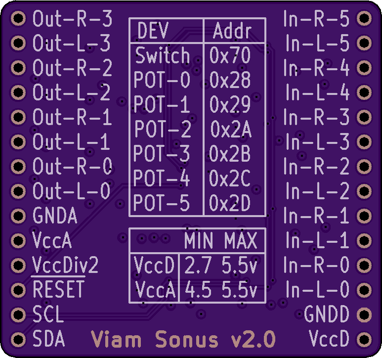

# Viam Sonus 2.0

An audio router board with integrated volume control and buffered output.

### FEATURES:
  * 12 input channels that are arbitrarily routable to any of 8 output channels.
* Onboard digital potentiometers on the input side with non-volatile storage. Pots are logarithmic with zero-cross detection, and are paired in order with their input numbers on the board's silkscreen.
* Onboard op-amps on the output side with 300mA drive capability to provide buffering for direct-drive of line-level signals.
* Onboard buffered voltage divider with exposed output and 300mA drive capability to aid design and implementation of input buffers.
* Resistors added to the input-side of the switch, but after the potentiometers to allow for simple resistance mixing of signals simply by routing two inputs to a given output without risking damage. Some caveats apply (discussed below).
* Input-side is left free-form to allow use with single-ended (unbalanced) or differential (balanced) signals, and/or DC-biased sources.
* Safe for 5v audio signals.
* Isolated analog and digital power planes.
* Silkscreen reflects the envisioned usage (stereo signals), but the driver allows for easy grouping of any number of channels.
* Breadboard-friendly

#### [Hackaday.io Page](https://hackaday.io/project/168501-viam-sonus-20)

#### [Order from Tindie](https://www.tindie.com/products/18586/)

------------------------

### What is in this repository:

**./doc**:  Location for documentation

**./KiCAD**:  Hardware design files

**./Arduino**:  Arduino driver

**./linux**:  Linux wrappers and utility program

------------------------

### Encountering real world audio signals

#### Mixing, ducking, and cross-fade

To avoid damaging the board, input-side circuits should be designed to limit
peak channel currents if mixing is going to be used. Discourse on that topic can
be found in [a separate document](https://joshianlindsay.com/index.php?id=184).

#### Tips on channel layout

The driver sees the board as 12 mono inputs with discrete volume control routed
to 8 mono outputs. The driver presents a channel-grouping layer to the user application
that largely abstracts the underlying mono channels. But since the DS1881 was
intended as a stereo device, it has properties that support that use...

  * Resistances are matched on its two halves.
  * Both halves can be set with a single bus operation (and thus happen concurrently)

So if you intend on using Viam Sonus to handle stereo inputs, you _can_ use whatever
two channels for left and right that you like, and the driver will make it work. But it
will cost an extra bus operation to set the volume for the pair, and the channel
resistance match might be as loose as +/-20%. So if you can, you will get better
results by keeping stereo pairs on matched channels.

The output channels are also paired into the output buffers, but the choice of
keeping those matched (or not) will have less-tangible consequences.

------------------------

### Notes on driver features:

#### Channel grouping

By default, there are no channel groups, and the API operates on the level of
discrete mono channels. But many application will want to manage _groups of channels_.

Channel groups come in two flavors: Input and Output. Each type has a unique API.

#### Preserve-on-destroy

When the driver instance for the switch is destroyed, the default behavior is to
put the hardware into a known state (reset). This opens all routes. Use-cases
that want the hardware state to outlive the driver's life cycle are possible by
setting preserveOnDestroy(true) ahead of `init()`, like so...

    // Class initializes with the existing state of the hardware.
    vs.preserveOnDestroy(true);
    vs.init(&Wire);

Since `init()` will also call `reset()` by default, preserveOnDestroy must be
enabled prior to `init()` to achieve the desired result (both sides of the driver life cycle).

#### Preserving and restoring hardware states

The driver provides a means of cloning prior states to and from a buffer.
Possible reasons for doing this might be...

  * Higher bus efficiency during `init()`.
  * Major code savings, since you can skip configuring the hardware and the class with discrete function calls.
  * Storage of complete board configurations that can be fully re-established with a minimum of overhead.

Saving the current state can be done like this (from the example sketch)...

    uint8_t buffer[VIAMSONUS_SERIALIZE_SIZE];
    unsigned int written = vs.serialize(buffer, VIAMSONUS_SERIALIZE_SIZE);
    if (VIAMSONUS_SERIALIZE_SIZE == written) {
      // Everything worked. Do what you will with the buffer.
    }

Restoring the state from a buffer can be done either upon construction...

    uint8_t buf[VIAMSONUS_SERIALIZE_SIZE] = {
      0x01, 0x00, 0x00, 0x00, 0x00, 0x01, 0x70, 0x0A, 0x00, 0x00, 0x00, 0x00,
      0x00, 0x00, 0x00, 0x00, 0x00, 0x00, 0x00, 0x00, 0x00, 0x00, 0x01, 0x28,
      0x00, 0x3F, 0x3F, 0x06, 0x01, 0x28, 0x00, 0x3F, 0x3F, 0x06, 0x01, 0x29,
      0x00, 0x3F, 0x3F, 0x06, 0x01, 0x29, 0x00, 0x3F, 0x3F, 0x06, 0x01, 0x2A,
      0x00, 0x3F, 0x3F, 0x06, 0x01, 0x2A, 0x00, 0x3F, 0x3F, 0x06 ...
    };
    ViamSonus vs(buf, VIAMSONUS_SERIALIZE_SIZE);

...or after a successful `init()`...

    // Literally anywhere in the sketch...
    vs.unserialize(buf, VIAMSONUS_SERIALIZE_SIZE);

If done by construction, the configuration will be written to the class immediately,
and to the hardware during `init()`.

Invocation of `unserialize()` will immediately result in I/O as the new
configuration is imparted, but the fields (if any) that are otherwise required for
construction will be ignored.

------------------------

### Usage under Arduino

In order to use this driver, you also need the Arduino drivers for the elements on the board. Clone the following repos into your user libraries (wherever you keep them):

[DS1881 Driver](https://github.com/jspark311/DS1881-Breakout/tree/master/Arduino)

[ADG2128 Driver](https://github.com/jspark311/ADG2128-Breakout/tree/master/Arduino)

[StringBuilder](https://github.com/jspark311/CppPotpourri)

After you've done that, you ought to be able to include the ViamSonus driver.

------------------------

### Usage under Linux

Fortunately, the Viam Sonus router board doesn't have any interrupt pins, which makes running it in userland fairly easy with existing kernel drivers for i2c and GPIO. The reset pin isn't _strictly_ required. It can be tied high.

------------------------

Front | Back
:-------:|:------:
  | 

